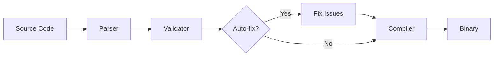
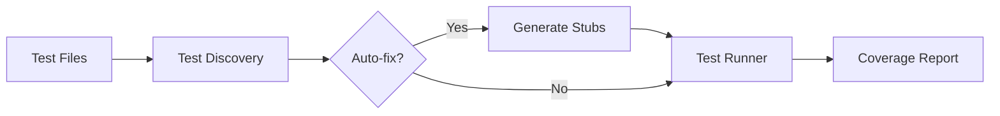

# MCP Development Tools Architecture

## Overview

The MCP development tools provide a comprehensive environment for building Model Context Protocol (MCP) applications in Rust, featuring the prism-cli package that installs both `prs` (development tools) and `prism` (platform management) commands.

## Components

### CLI (prs)
The command-line interface is the primary user interaction point.

#### Architecture
```
tools/prism-cli/
├── src/
│   ├── main.rs          # Entry point for prs command
│   ├── prism.rs         # Entry point for prism command
│   ├── cli.rs           # Command definitions
│   ├── commands/        # Command implementations
│   │   ├── mod.rs       # Command router
│   │   ├── build.rs     # Build command
│   │   ├── test.rs      # Test command
│   │   └── ...          # Other commands
│   ├── templates/       # Project templates
│   ├── config.rs        # Configuration management
│   └── utils.rs         # Utility functions
└── build.rs             # Build script for doc generation
```

### Command Flow

1. **Parser Phase**: Clap parses command-line arguments
2. **Validation Phase**: Commands validate their inputs
3. **Execution Phase**: Commands execute their logic
4. **Auto-fix Phase**: Optional auto-fix for issues
5. **Output Phase**: Results displayed to user

### Key Design Decisions

#### 1. Auto-fix Capability
Many commands support `--fix` flag for automatic issue resolution:
- Reduces manual intervention
- Improves developer experience
- Maintains consistency

#### 2. Template System
Flexible template system for project generation:
- Server templates: stdio, http, websocket
- Plugin templates: basic, tool, resource, prompt
- Client templates: basic

#### 3. Progressive Enhancement
Commands work at basic level but offer advanced features:
- Basic: Simple execution
- Enhanced: With progress indicators
- Advanced: With auto-fix and optimization

## Data Flow

### Build Process


### Test Process


## Error Handling

### Strategy
1. **Graceful Degradation**: Commands continue when possible
2. **Clear Messaging**: User-friendly error messages
3. **Recovery Options**: Suggest fixes or alternatives
4. **Auto-fix Integration**: Automatic resolution where possible

### Error Types
- **Configuration Errors**: Missing or invalid config
- **Build Errors**: Compilation failures
- **Runtime Errors**: Execution failures
- **Validation Errors**: Structure violations

## Performance Considerations

### Optimizations
1. **Lazy Loading**: Load only required modules
2. **Parallel Execution**: Use tokio for async operations
3. **Caching**: Cache build artifacts and test results
4. **Incremental Updates**: Only rebuild changed components

## Security

### Principles
1. **Least Privilege**: Commands run with minimal permissions
2. **Input Validation**: All inputs sanitized
3. **Secure Defaults**: Safe configuration out of the box
4. **Dependency Scanning**: Regular security audits

## Future Enhancements

### Planned Features
1. **Plugin System**: Extensible command architecture
2. **Cloud Integration**: Remote build and test
3. **AI Assistance**: Smart error resolution
4. **Performance Profiling**: Built-in profiling tools

### Scalability
- Modular architecture allows easy extension
- Command pattern enables plugin development
- Async design supports concurrent operations

## Testing Strategy

### Unit Tests
- Each command has dedicated tests
- Mock external dependencies
- Test error conditions

### Integration Tests
- End-to-end command execution
- Template generation verification
- Build and test pipeline validation

### Documentation Tests
- All examples in documentation tested
- API documentation verified
- Command help text validation